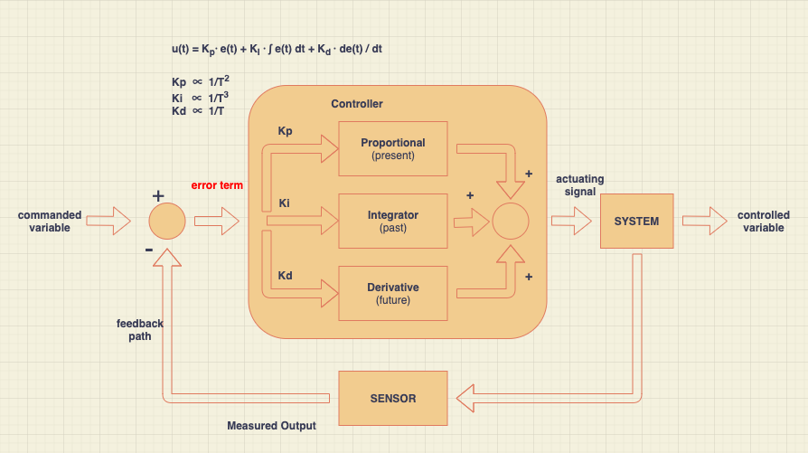
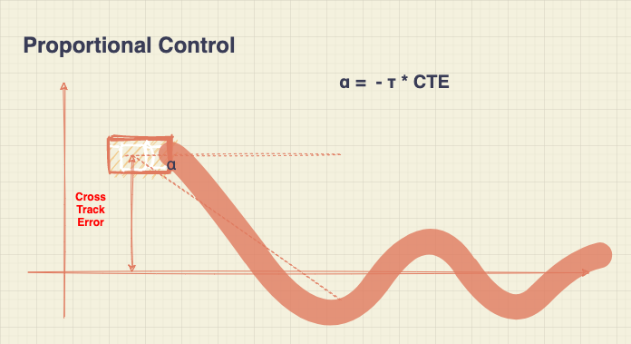
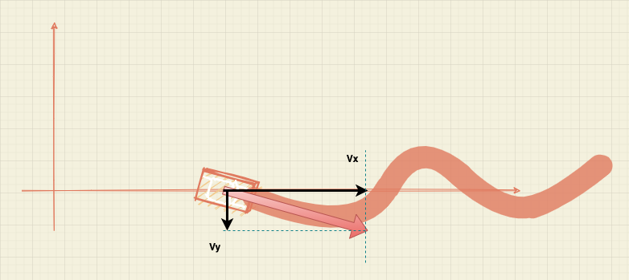
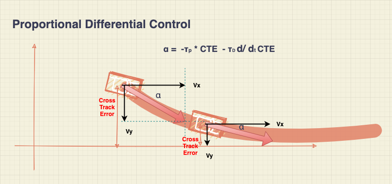
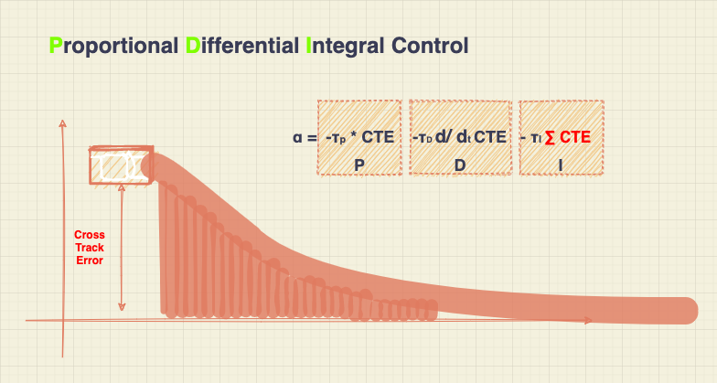
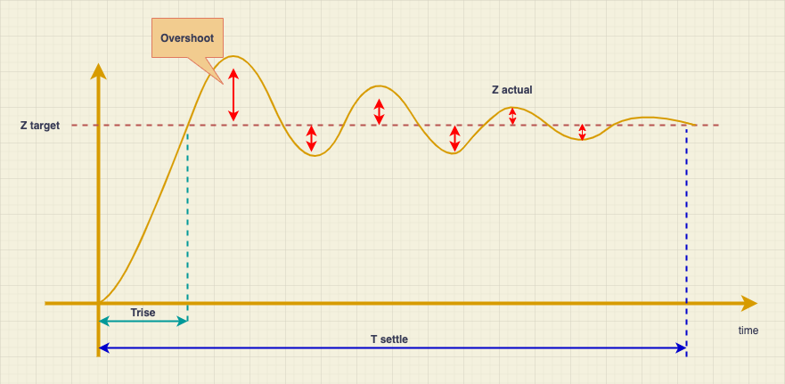
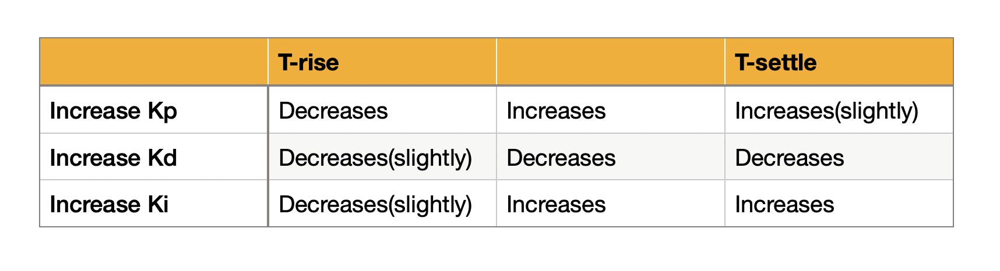

# PID Controls

The project implements a PID controller in C++ to maneuver the vehicle around the track.

---

### PID controller



PID controller generates a steering value (actuating signal) to input "SYSTEM", which is a simulator in the project. in feedback control, The simulator will provide the cross-track error (CTE) and so on To simulate Senser data. So I can find how far off the vehicle is from where I want it to be. So the cross-track Error (CTE) is an error term that is the distance between vehicle position and centerline position. If the steering value is accurate. the error term would be zero. So the target is how do I take this CTE and convert it into a suitable steering value.



Using the CTE at the present moment to decide How much "α" are going to rotate . For example If the CTE is 10m and  I set P-controller τ as 0.1 . then I can get the steer speed is 1 rad/s. So A second later， the steering value would be 1 rad , So I can get
```α = 1 * 180 / π```

So the "α" is proportional to The CTE. In the project, I directly design P-Controller as  ```Kp * p_error```

But here a problem. the Vehicle does not stop when it reaches the centerline. The speed of a vehicle can be decomposed into horizontal and vertical speeds.

So the vehicle is overshoot. When the vehicle tried to fix the overshoot, it would create a Vy in the opposite direction. So the Vy is never to be zero.



We need a controller to respond to how fast the Vehicle's closing in on the goal. So a derivative is a better way to measure the rate of change of the error that is how fast the error is growing or shrinking.
For example, if the vehicle is running quickly and fast approaching the centerline. this means that the error is quickly decreasing, That decreasing error has a negative rate of change, which will produce a negative value. That negative value will be added to our controller's output. Therefore lowering the steering value. preventing the Vehicle from overshooting. In the project, I take current CTE minus the Prevouise CTE  ```Kd *(cte - p_error)```


When there is a bias in the system, we had better use past CTE data to correct the system bias. So Integral controller will do calculate all the CTE Subtract from the steering value. In the project, I take ```Ki * ∑ cte```.

There are three branches each contribute some amount to the overall output of the controller and there are three parameters to weigh each controller contribution.  So the finial controller output is ``` -Kp *p_error - Ki* i_error - Kd * d_error ```

The next step is tuning the parameters ```Kp Ki Kd```

### PID paramaters tuning



#### PID tuning guide



- step 1: pid_a.Init(0.1, 0.001, 1);
First I set initial value as Kp = 0.1 Ki = 0.01 Kd = 1. Becasue Because Kp, Ki, Kd is inversely proportional to T. The vehicle ran out of the left lane . So I increased Kp to decrease T-rise.

- step 2: pid_a.Init(0.2, 0.001, 1)
  The T-rise is better then before. So I increased a small value.

- step 3: pid_a.Init(0.25, 0.001, 2)
  The vehicle oscillated , I increased Kd to decrease overshoot.

- step 4: pid_a.Init(0.25, 0.001, 3)
  The Oscillating situation is not better, I need to continue to increase the Kd.

- step 5: pid_a.Init(0.25, 0.001, 4)
  When the vehicle runs through a fast curve lane, goes out of the lane. I increased Kd to deal with strong changes in future data

- step 6: pid_a.Init(0.25,0.001, 5);  
  The vehicle oscillate wiht weakening intensity, I increased Kd to decrease overshoot

- step 7: pid_a.Init(0.25, 0.001, 5.5);
  The vehicle was slightly overshooting. I increased Kd to a small value.

- step 8: pid_a.Init(0.25, 0.001, 5.75);
  The vehicle went off the track on the second lap, I increased Kd to decrease overshoot.

- step 9: pid_a.Init(0.25, 0.001, 6.0);
  The controller works well with these parameters. No further Twiddle algorithm was required, and the Twiddle algorithm was not very efficient in this project.

## Build

1. Clone this repo.
2. Make a build directory: `mkdir build && cd build`
3. Compile: `cmake .. && make`
4. Run it: `./pid`.

The environment can be found [here](https://classroom.udacity.com/nanodegrees/nd013/parts/40f38239-66b6-46ec-ae68-03afd8a601c8/modules/0949fca6-b379-42af-a919-ee50aa304e6a/lessons/f758c44c-5e40-4e01-93b5-1a82aa4e044f/concepts/23d376c7-0195-4276-bdf0-e02f1f3c665d)

## Licensing, Authors, and Acknowledgements <a name="licensing"></a>

### Built With

- cmake >= 3.5
- All OSes: [click here for installation instructions](https://cmake.org/install/)
- make >= 4.1(mac, linux), 3.81(Windows)
  - Linux: make is installed by default on most Linux distros
  - Mac: [install Xcode command line tools to get make](https://developer.apple.com/xcode/features/)
  - Windows: [Click here for installation instructions](http://gnuwin32.sourceforge.net/packages/make.htm)
- gcc/g++ >= 5.4
  - Linux: gcc / g++ is installed by default on most Linux distros
  - Mac: same deal as make - [install Xcode command line tools]((<https://developer.apple.com/xcode/features/>)
  - Windows: recommend using [MinGW](http://www.mingw.org/)
- [uWebSockets](https://github.com/uWebSockets/uWebSockets)
  - Run either `./install-mac.sh` or `./install-ubuntu.sh`.
  - If you install from source, checkout to commit `e94b6e1`, i.e.

### Versioning

- We use [SemVer](http://semver.org/) for versioning. For the versions available, see the [tags on this repository](https://github.com/your/project/tags).

### Authors

- **Tom Ge** - *Self-Driving Car egineer* - [github profile](https://github.com/tomgtqq)

### License

- This project is licensed under the MIT License
